# Verifix — Building Maintenance Management System

**Full-stack building maintenance management platform — breakdown calls, preventive maintenance, SLA tracking, asset management, supplier book, budget tracking, and multi-building support.**

Verifix replaces manual maintenance management with a structured, real-time system. Built for facility managers handling multiple buildings, contractors, and compliance requirements.

> Built for and deployed at **Israel Ports Company** — managing 5 buildings including headquarters at Menachem Begin 74, Tel Aviv.

---

## Tech Stack

| Layer | Technology |
|-------|-----------|
| Frontend | Next.js 14, React, Tailwind CSS |
| Backend | Next.js API Routes, Node.js |
| Database | PostgreSQL (Railway managed) |
| ORM | Prisma |
| Auth | JWT + middleware route protection |
| Deployment | Railway (continuous deployment) |
| Notifications | WhatsApp API, Email |
| Language | TypeScript |

---

## Screenshots

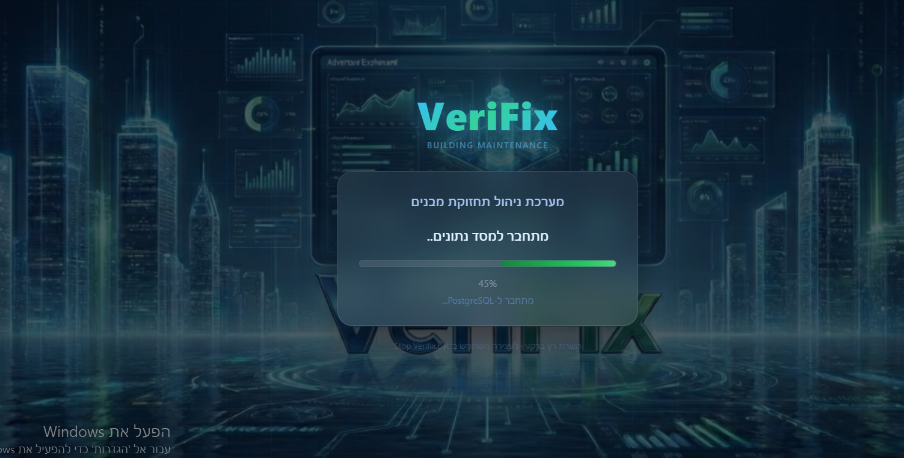

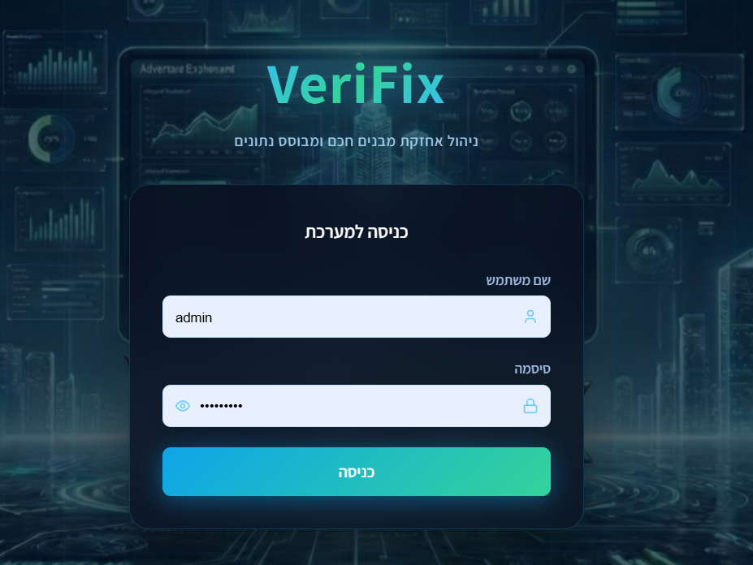

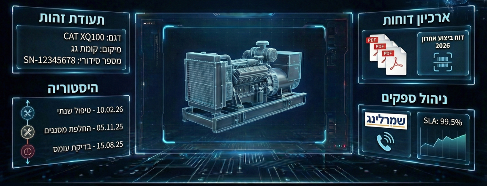

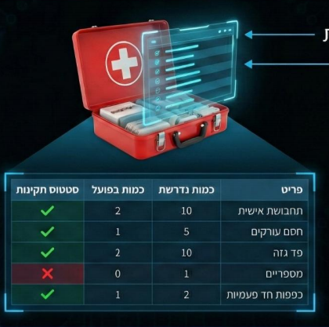

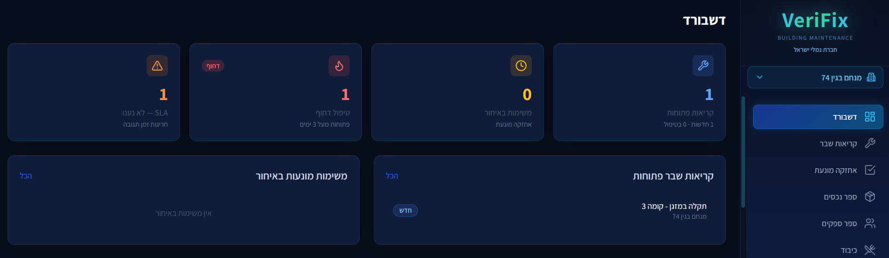

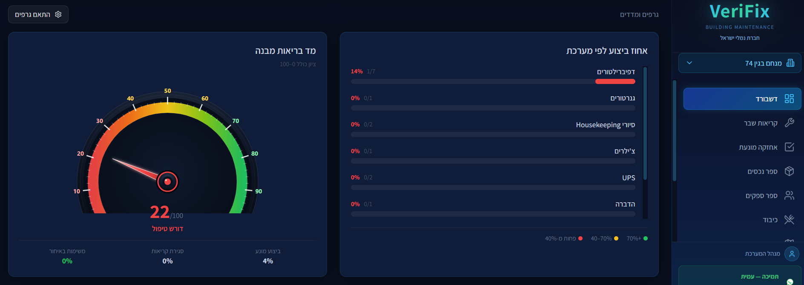

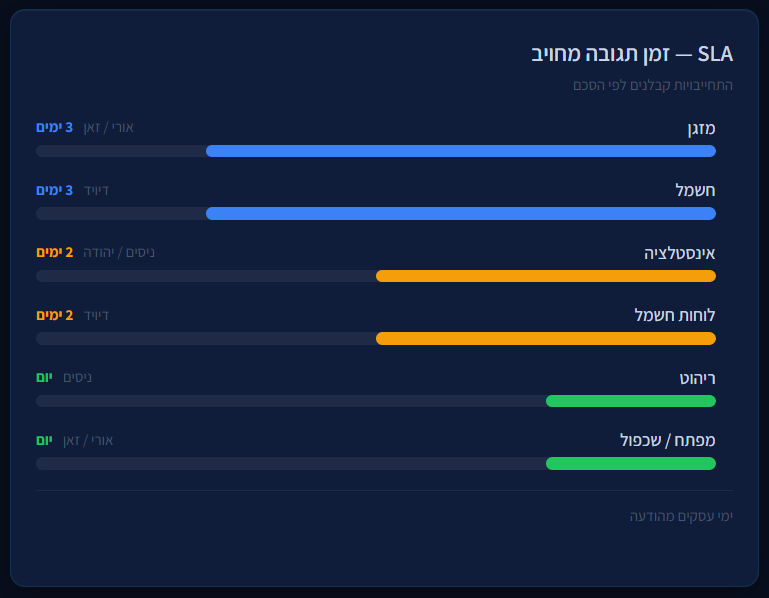

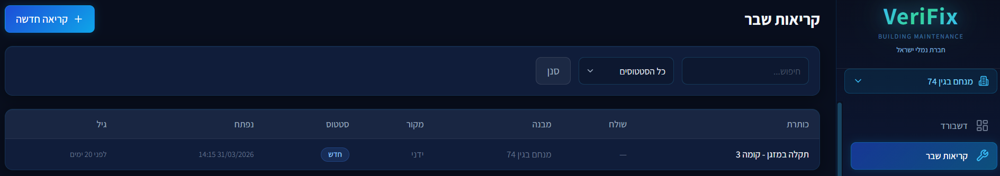

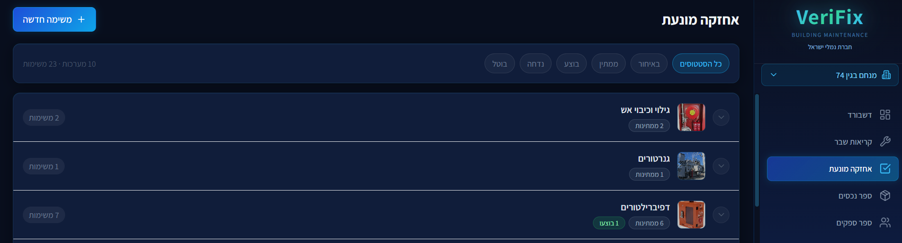

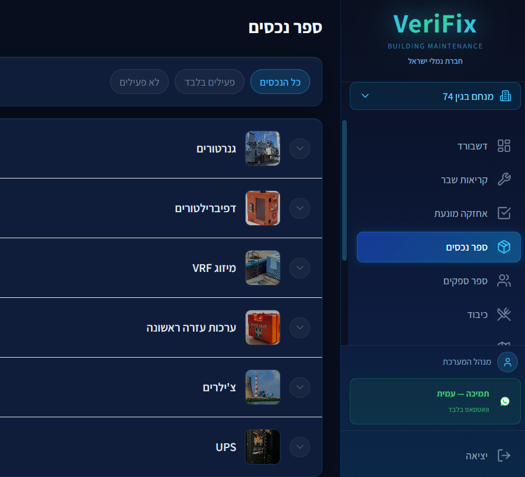

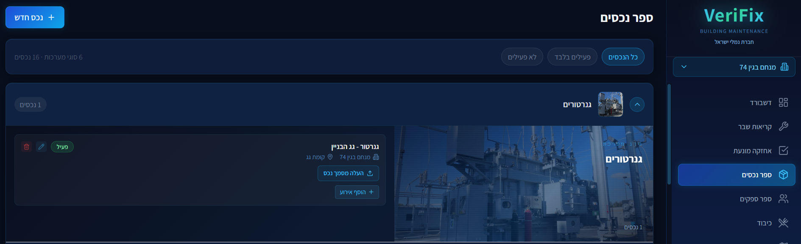

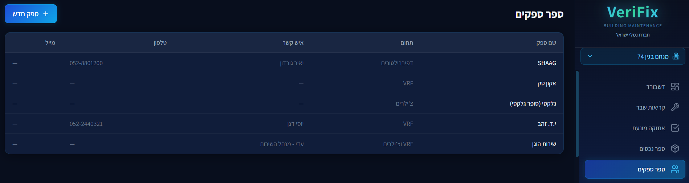

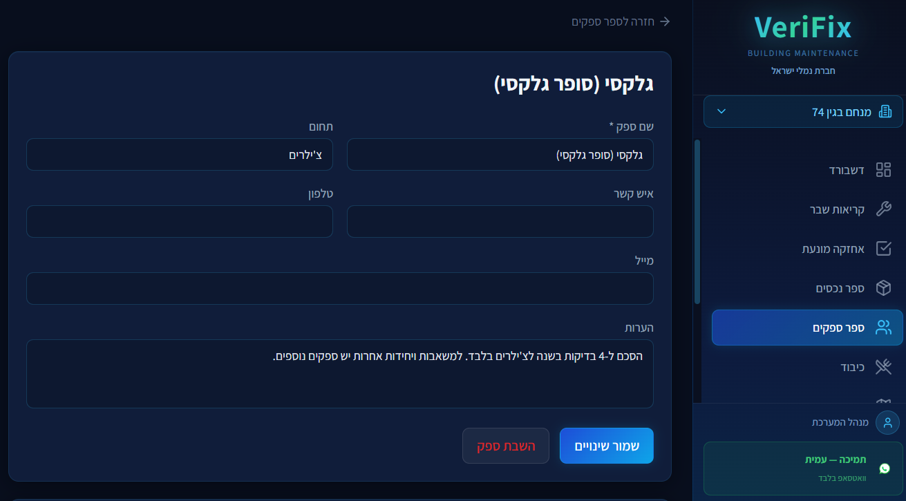

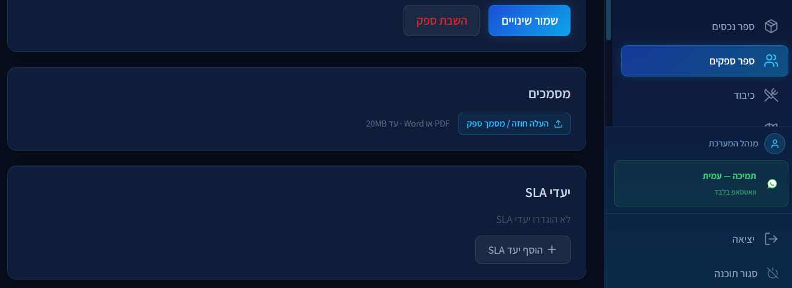

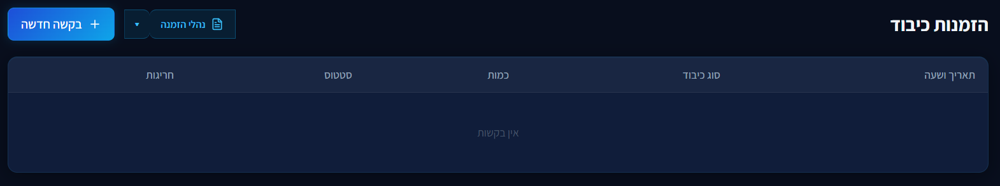

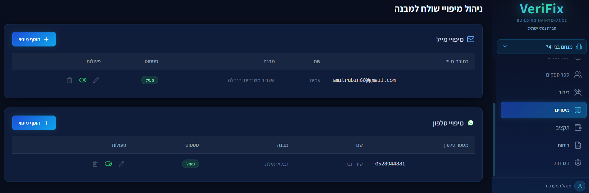

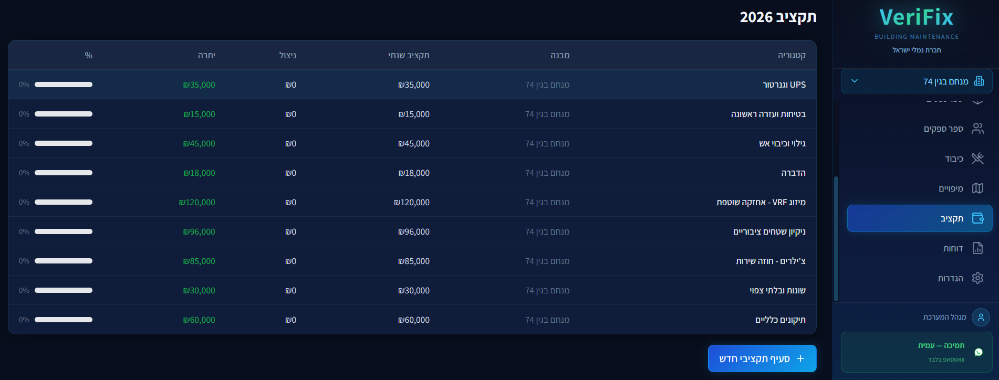

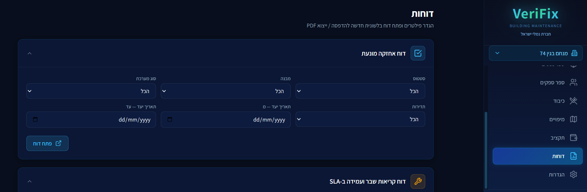

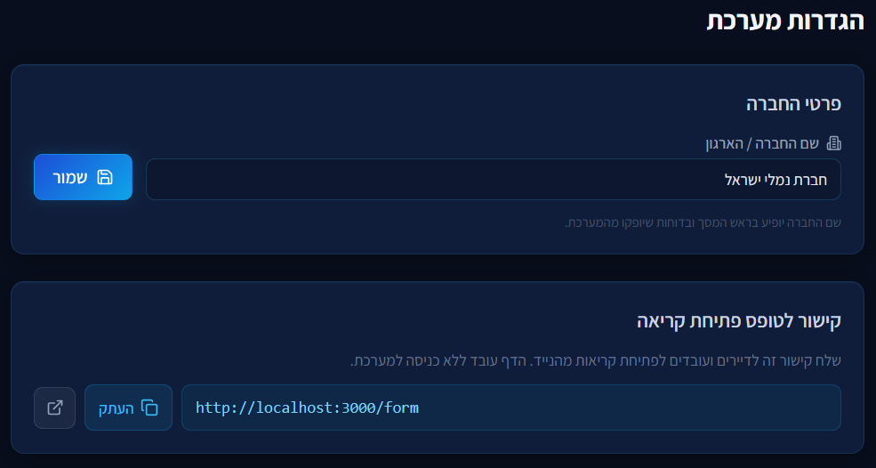

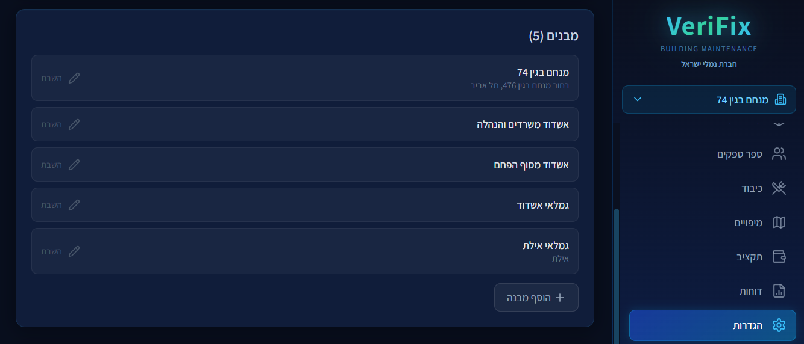

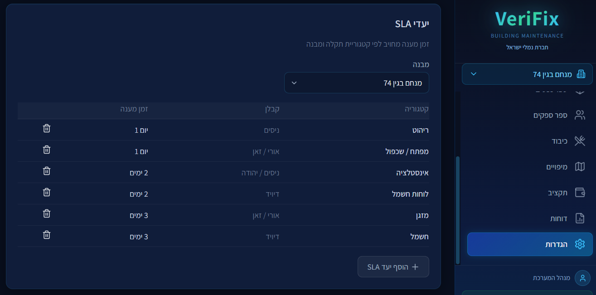

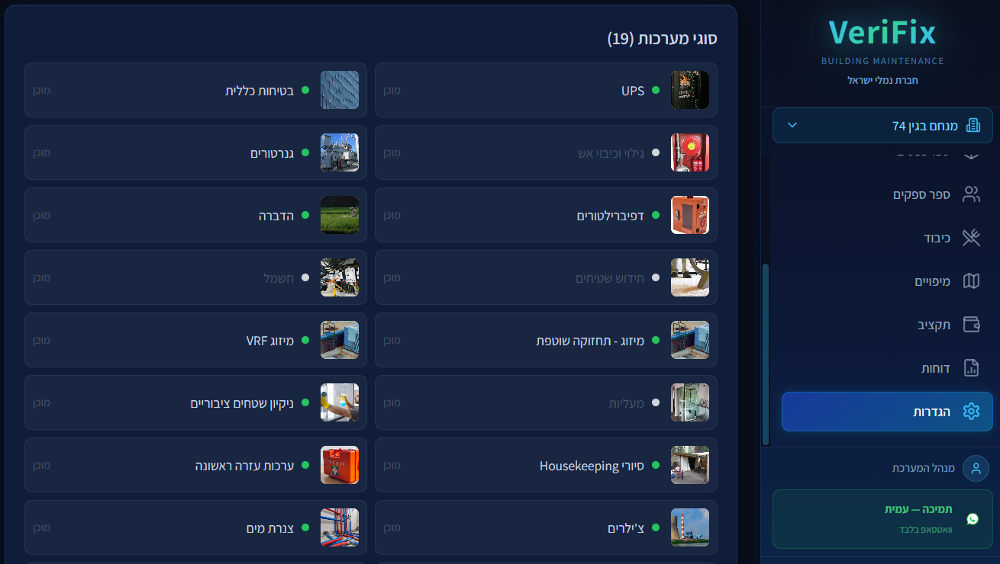

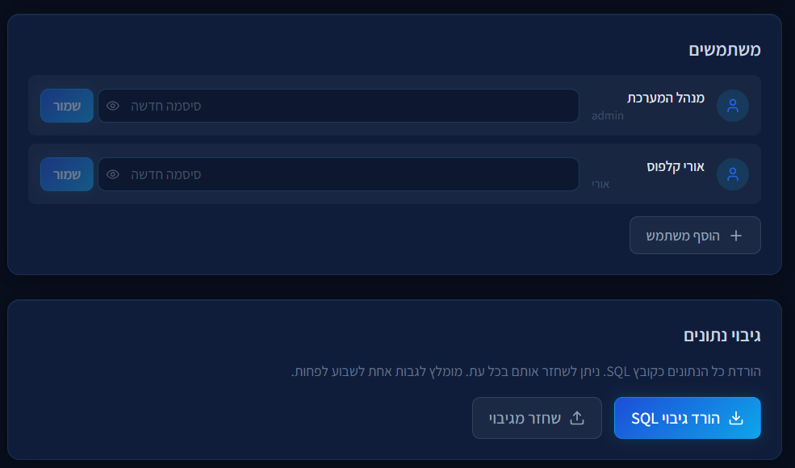

---

## Features

- **Breakdown calls** — open from any device, with or without login. Automatic routing to the correct building via mapping engine
- **Preventive maintenance** — task tracking per system with status, deadlines, and completion rates
- **Building health meter** — composite score (0–100) based on open calls, SLA compliance, and maintenance execution
- **Asset book** — full inventory per building and floor with document upload
- **Supplier book** — directory with SLA commitments, contacts, and linked system types
- **SLA management** — define response time targets per category and contractor, with breach alerts
- **Annual budget** — allocation and utilization tracking per category
- **Reports** — filterable PDF-ready reports for preventive maintenance and breakdown calls
- **Multi-building** — up to 5+ buildings under one account with independent data
- **Notifications** — WhatsApp and email alerts on new calls and SLA breaches
- **SQL backup** — full database export and restore on demand
- **User management** — role-based access with admin controls

---

## Author

**Amit Rubin**
ERP & AI Operations Lead | QA, Automation & Product at Hashavshevet (Wizsoft)

